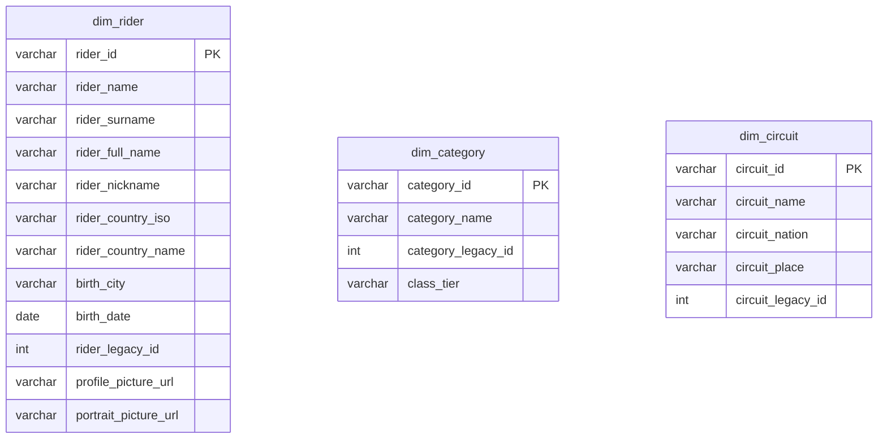
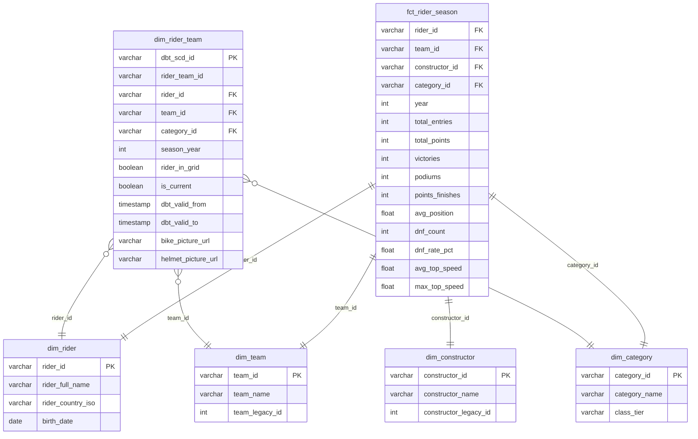
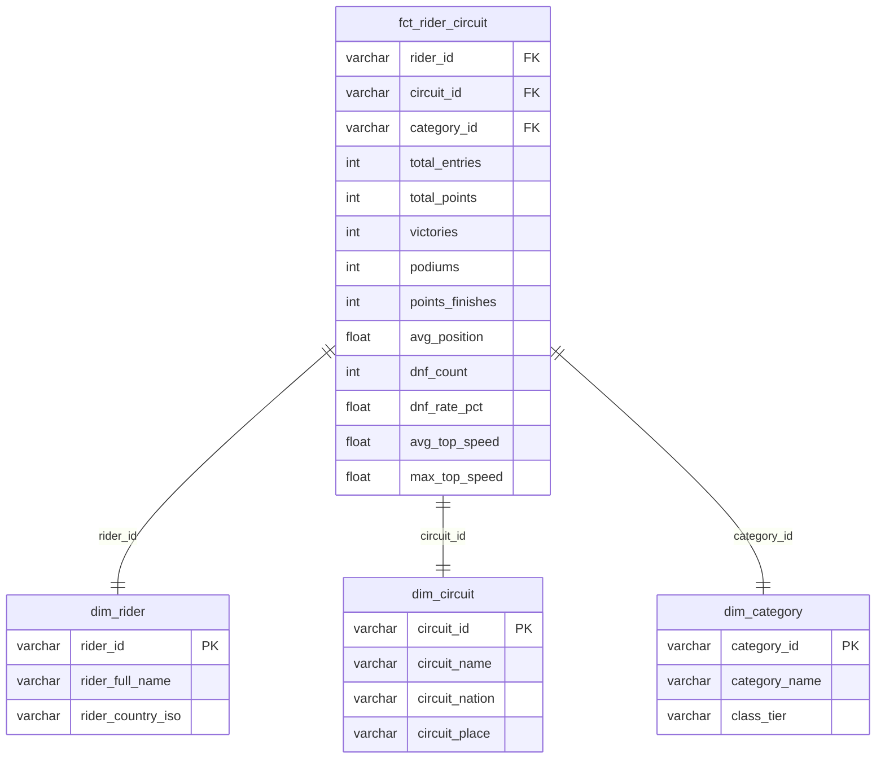
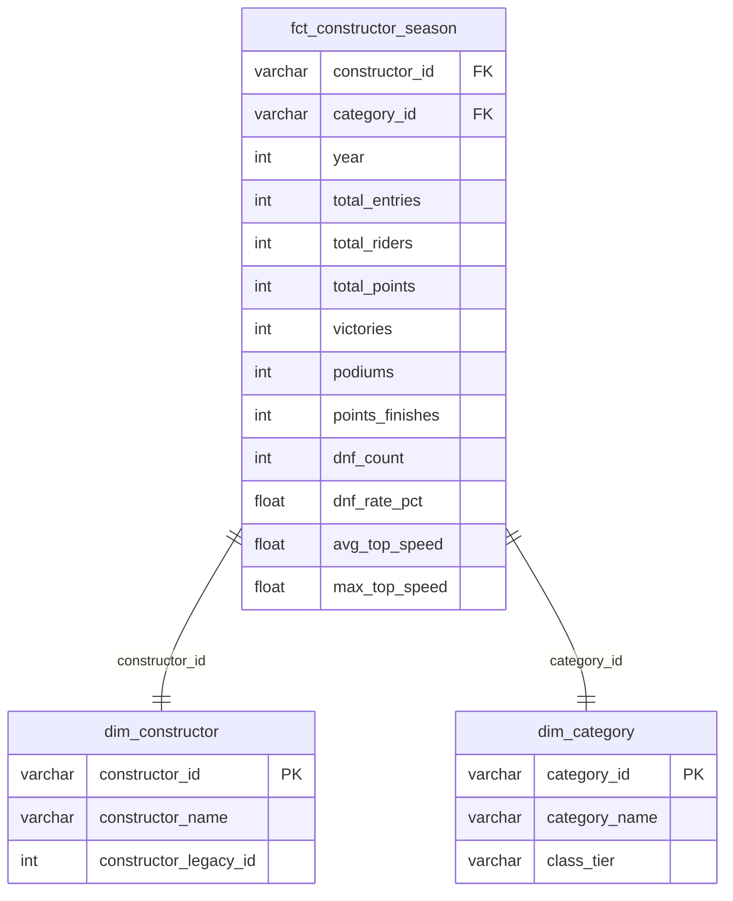
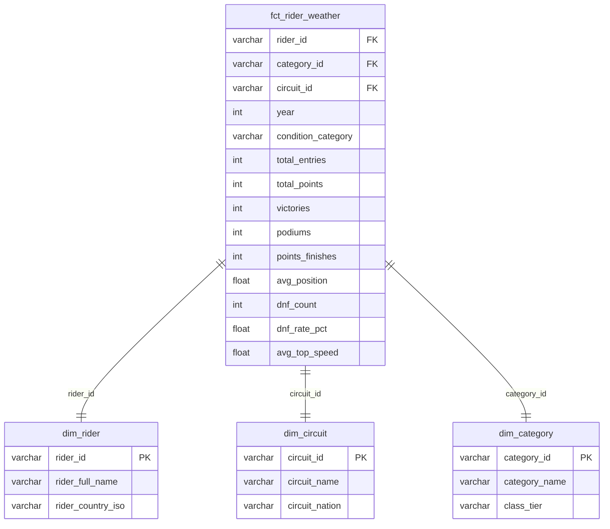

# MotoGP Analytics Python + Snowflake + dbt + Power Bi 
</br>
<p align="center">
  
</p>
</br>
> Pipeline de datos end-to-end sobre el Campeonato del Mundo de MotoGP (1949 – presente).
> Ingesta desde API pública → Snowflake Bronze → Silver (dbt staging + intermediate) → Gold (dbt marts).

---

## Tabla de contenidos

- [Visión general](#visión-general)
- [Arquitectura](#arquitectura)
- [Fuente de datos](#fuente-de-datos)
- [Ingesta con Python](#ingesta-con-python)
  - [Descarga: `download_motogp.py`](#descarga-download_motogppy)
  - [Carga a Snowflake: `ingest_motogp.py`](#carga-a-snowflake-ingest_motogppy)
- [Capa Bronze — RAW](#capa-bronze--raw)
- [Capa Silver — Staging & Intermediate](#capa-silver--staging--intermediate)
- [Capa Gold — Marts](#capa-gold--marts)
  - [Dimensiones compartidas](#dimensiones-compartidas)
  - [Caso de uso: Rendimiento por temporada (Ascensor)](#caso-de-uso-rendimiento-por-temporada-ascensor)
  - [Caso de uso: Rendimiento por circuito (Circuit)](#caso-de-uso-rendimiento-por-circuito-circuit)
  - [Caso de uso: Rendimiento por constructor (Constructor)](#caso-de-uso-rendimiento-por-constructor-constructor)
  - [Caso de uso: Rendimiento por condición climática (Weather)](#caso-de-uso-rendimiento-por-condición-climática-weather)
- [Snapshots SCD2](#snapshots-scd2)
- [Seeds](#seeds)
- [Macros](#macros)
- [Tests y calidad de datos](#tests-y-calidad-de-datos)
- [Estructura del proyecto](#estructura-del-proyecto)
- [Cómo ejecutar](#cómo-ejecutar)

---

## Visión general

Este proyecto construye un **data warehouse analítico** sobre 75+ años de historia del Campeonato del Mundo de Motociclismo. El objetivo es responder preguntas como:

- ¿Cuál es el rendimiento histórico de un piloto en un circuito concreto?
- ¿Qué constructor ha ganado más carreras en lluvia en la era moderna?
- ¿Cómo evoluciona la carrera de un piloto a lo largo de las temporadas?
- ¿Qué piloto tiene la mejor tasa de victorias en condiciones mixtas?

Los datos cubren **todas las categorías** (MotoGP/500cc, Moto2/250cc, Moto3/125cc, Sidecar…) desde **1949 hasta la temporada en curso**.

---

## Arquitectura

```
                        ┌─────────────────────────────────────────────────────────────────────────────┐
                        │                          FUENTE DE DATOS                                    │
                        │         API Micheleberardi  ·  api.micheleberardi.com/racing/v1.0           │
                        │         Rate limit: 50 llamadas/min · 200/hora · 500/día                    │
                        └─────────────────────────┬───────────────────────────────────────────────────┘
                                                  │  POST requests (JWT)
                                                  ▼
                        ┌─────────────────────────────────────────────────────────────────────────────┐
                        │                     INGESTA PYTHON  (injesta_python/)                       │
                        │                                                                             │
                        │   download_motogp.py          ingest_motogp.py                              │
                        │   ─────────────────           ────────────────────────────────────          │
                        │   API → CSV locales           CSV locales → Snowflake (PUT + COPY INTO)     │
                        │   motogp_data_YYYY_YYYY/      Normalización · Coerción de tipos             │
                        │                               Columnas de auditoría (_ingested_at, md5…)    │
                        └─────────────────────────┬───────────────────────────────────────────────────┘
                                                  │
                                                  ▼
                        ┌─────────────────────────────────────────────────────────────────────────────┐
                        │   BRONZE  ·  DEV_MOTOGP_BRONZE_DB.RAW                                       │
                        │   ─────────────────────────────────────────────────────────────────────     │
                        │   seasons · categories · events · sessions · results · standings            │
                        │   calendar · files                                                          │
                        │   Datos crudos, sin transformar. Columnas de auditoría prefijadas con _     │
                        └─────────────────────────┬───────────────────────────────────────────────────┘
                                                  │  dbt run (staging)
                                                  ▼
                        ┌─────────────────────────────────────────────────────────────────────────────┐
                        │   SILVER  ·  DEV_MOTOGP_SILVER_DB.SILVER                                    │
                        │   ─────────────────────────────────────────────────────────────────────     │
                        │   stg_season · stg_category · stg_event · stg_session · stg_result          │
                        │   stg_rider · stg_team · stg_constructor · stg_standing                     │
                        │   stg_rider_team_season · stg_circuit                                       │
                        │   ────────────────────────────────────────────────────────────────────      │
                        │   int_race_results  (view — join results + sessions)                        │
                        │   snap_rider_team   (SCD2 — histórico piloto–equipo)                        │
                        └─────────────────────────┬───────────────────────────────────────────────────┘
                                                  │  dbt run (marts)
                                                  ▼
                        ┌─────────────────────────────────────────────────────────────────────────────┐
                        │   GOLD  ·  DEV_MOTOGP_GOLD_DB.GOLD                                          │
                        │   ─────────────────────────────────────────────────────────────────────     │
                        │   DIMENSIONES COMPARTIDAS          CASOS DE USO                             │
                        │   dim_rider                        fct_rider_season   (ascensor)            │
                        │   dim_category                     fct_rider_circuit  (circuit)             │
                        │   dim_circuit                      fct_constructor_season (constructor)     │
                        │                                    fct_rider_weather  (weather)             │
                        │                                    dim_rider_team (SCD2)                    │
                        │                                    dim_team · dim_constructor               │
                        └─────────────────────────────────────────────────────────────────────────────┘
```

---

## Fuente de datos

**API:** [Michele Berardi MotoGP API](https://api.micheleberardi.com/swagger/#/API%20MOTOGP%20NEW/post_motogp_season)

Todos los endpoints son `POST` y requieren autenticación mediante **token JWT** pasado como query parameter.

| Endpoint principal | Descripción |
|---|---|
| `/racing/v1.0/motogp/season` | Temporadas disponibles |
| `/racing/v1.0/motogp/categories` | Categorías por año |
| `/racing/v1.0/motogp/events` | Grandes Premios por temporada |
| `/racing/v1.0/motogp/sessions` | Sesiones por evento y categoría |
| `/racing/v1.0/motogp/results` | Resultados por sesión |
| `/racing/v1.0/motogp/standings` | Clasificación del campeonato |

**Rate limit:** 50 llamadas/minuto · 200/hora · 500/día. El script de descarga respeta el límite con una pausa configurable entre llamadas (por defecto 1.3 s).

Los datos históricos (1949–2023) se descargaron en bulk y se almacenan en los directorios `dataset/motogp_data_*`. Los datos del año en curso se actualizan evento a evento tras cada Gran Premio.

---

## Ingesta con Python

Los scripts de ingesta se encuentran en `injesta_python/`.

### Descarga: `download_motogp.py`

Descarga los datos de la API y los persiste como **CSV locales** organizados por entidad y año:

```
motogp_data_2026_2026/
├── seasons.csv
├── categories/
│   └── categories_2026.csv
├── events/
│   └── events_2026.csv
├── sessions/
│   └── sessions_<event_id>_<category_id>.csv
├── sessions_sprint/
│   └── sessions_sprint_<event_id>_<category_id>.csv
├── results/
│   └── results_<session_id>.csv
├── standings/
│   └── standings_<category_id>.csv
└── calendar/
    ├── calendar_full.csv
    └── calendar_upcoming.csv
```

**Uso:**
```bash
# Descargar eventos de 2026 desde el 9 de mayo
python download_motogp.py --year 2026 --from-date 2026-05-09

# Con rango de fechas
python download_motogp.py --year 2026 --from-date 2026-05-09 --to-date 2026-05-12
```

**Variable de entorno requerida:**
```bash
export MOTOGP_API_TOKEN="<tu_jwt_token>"
```

---

### Carga a Snowflake: `ingest_motogp.py`

Lee los CSV locales, normaliza los datos por entidad y los carga a Snowflake usando un **stage interno** (patrón `PUT → COPY INTO`). Es idempotente: re-ejecuciones con `--truncate` limpian la tabla antes de insertar.

**Flujo de carga:**
```
DataFrame pandas
    → coerción de tipos (Int64, boolean, date, datetime)
    → serialización CSV.gz (gzip)
    → PUT al stage @DEV_MOTOGP_BRONZE_DB.RAW.MOTOGP_STAGE/{entidad}/{timestamp}/
    → COPY INTO tabla Bronze (MATCH_BY_COLUMN_NAME, ON_ERROR=CONTINUE)
    → (opcional) PURGE del stage
```

**Uso:**
```bash
# Carga completa (todas las entidades, todos los datasets)
python ingest_motogp.py --root-dir ../dataset

# Solo cargar resultados de 2026, truncando antes
python ingest_motogp.py --root-dir ../dataset --year 2026 --only results --truncate

# Dry run (descubrir sin tocar Snowflake)
python ingest_motogp.py --root-dir ../dataset --dry-run
```

**Variables de entorno requeridas:**
```bash
export SNOWFLAKE_ACCOUNT="<account>"
export SNOWFLAKE_USER="<user>"
export SNOWFLAKE_PASSWORD="<password>"
export SNOWFLAKE_WAREHOUSE="<warehouse>"
export SNOWFLAKE_DATABASE="DEV_MOTOGP_BRONZE_DB"
export SNOWFLAKE_SCHEMA="RAW"
```

**Entidades cargadas:** `seasons`, `categories`, `events`, `sessions`, `results`, `standings`, `calendar`, `files`

Cada tabla recibe **columnas de auditoría** añadidas automáticamente:

| Columna | Descripción |
|---|---|
| `_source_file` | Nombre del CSV de origen |
| `_source_dataset` | Directorio `motogp_data_*` de origen |
| `_ingested_at` | Timestamp UTC de inserción en Snowflake |
| `md5` | Hash MD5 del registro para detección de cambios |

---

## Capa Bronze — RAW

**Base de datos:** `DEV_MOTOGP_BRONZE_DB`  
**Schema:** `RAW`

Datos ingestados directamente desde la API, **sin transformar**. El objetivo de esta capa es fidelidad total al origen: si la API devuelve un valor incorrecto, Bronze lo conserva exactamente.

| Tabla | Descripción | Grain |
|---|---|---|
| `SEASONS` | Catálogo de temporadas del campeonato | 1 fila por año |
| `CATEGORIES` | Categorías de competición por año | 1 fila por categoría × año |
| `EVENTS` | Grandes Premios disputados | 1 fila por Gran Premio |
| `SESSIONS` | Sesiones de cada Gran Premio (FP, Q, RAC, SPR…) | 1 fila por sesión × categoría |
| `RESULTS` | Resultados por piloto por sesión | 1 fila por piloto × sesión |
| `STANDINGS` | Clasificación del campeonato mundial | 1 fila por piloto × categoría × año |
| `CALENDAR` | Calendario con fechas y horarios de sesiones | 1 fila por evento del calendario |
| `FILES` | Índice de archivos de resultados de la API | 1 fila por recurso disponible |

**Tipos de sesión en Bronze** (campo `type`):

| Código | Significado |
|---|---|
| `FP` | Free Practice |
| `P` | Combined Practice |
| `TTS` | Test / Time Trial |
| `QP` | Qualifying Practice (pre-2012) |
| `Q` | Qualifying |
| `RAC` | Race |
| `SPR` | Sprint |
| `WUP` | Warm Up |
| `EP` | Extra Practice |
| `PR` | Practice Race |

> **Nota:** los valores `FP1`, `FP2`, `Q1`, `Q2` **no existen en Bronze**. Son interpretaciones que se resuelven en la capa Silver a partir del tipo + número de sesión.

---

## Capa Silver — Staging & Intermediate

**Base de datos:** `DEV_MOTOGP_SILVER_DB`  
**Schema:** `SILVER`  
**Materialización:** tablas (staging) + vistas (intermediate)

Esta capa aplica **limpieza, normalización y estandarización** sobre los datos Bronze. Cada modelo `stg_*` expone exactamente una entidad con tipos correctos, claves naturales validadas y columnas renombradas según las convenciones del proyecto.

### Modelos de staging

| Modelo | Fuente Bronze | Transformaciones clave |
|---|---|---|
| `stg_season` | `SEASONS` | Cast de tipos, campo `is_current` como booleano |
| `stg_category` | `CATEGORIES` | Deduplicación, campo `class_tier` (Premier / Intermediate / Junior / Historical) |
| `stg_event` | `EVENTS` | Limpieza de fechas, FK a temporada |
| `stg_session` | `SESSIONS` | Normalización de `type`, flag `is_sprint`, parse de `session_date` |
| `stg_result` | `RESULTS` | Derivación de `status_category` (INSTND→FINISH, OUTSTND→DNF), cast numérico de `gap_first` / `points` |
| `stg_rider` | `RESULTS` | Deduplicación de pilotos únicos con sus atributos personales |
| `stg_team` | `RESULTS` | Deduplicación de equipos únicos |
| `stg_constructor` | `RESULTS` | Deduplicación de constructores únicos |
| `stg_standing` | `STANDINGS` | Cast de `points` y `position` |
| `stg_rider_team_season` | `RESULTS` | Relación piloto–equipo–categoría–temporada, fuente del snapshot SCD2 |
| `stg_circuit` | `EVENTS` / `SESSIONS` | Dimensión de circuitos deduplicada |

### Intermediate

| Modelo | Descripción |
|---|---|
| `int_race_results` | Join entre `stg_result` y `stg_session`. Añade contexto de sesión (tipo, condiciones meteorológicas, fecha) a cada resultado. Es la base de todos los marts. |

---

## Capa Gold — Marts

**Base de datos:** `DEV_MOTOGP_GOLD_DB`  
**Schema:** `GOLD`  
**Materialización:** tablas

Los marts están organizados por **caso de uso**. Todas las fact tables usan la macro `race_metrics()` para garantizar métricas consistentes entre marts.

**Métricas comunes** (`race_metrics` macro):

| Métrica | Descripción |
|---|---|
| `total_entries` | Total de carreras disputadas |
| `total_points` | Suma de puntos de campeonato |
| `victories` | Victorias (position = 1) |
| `podiums` | Podios (position ≤ 3) |
| `points_finishes` | Finales en puntos (position ≤ 10) |
| `avg_position` | Posición media |
| `dnf_count` | Número de abandonos |
| `dnf_rate_pct` | Tasa de abandono (%) |

---

### Dimensiones compartidas

Utilizadas por todos los casos de uso. Se encuentran en `models/marts/shared/`.



---

### Caso de uso: Rendimiento por temporada (Ascensor)

> **Pregunta clave:** ¿Cómo rinde un piloto temporada a temporada, con qué equipo y en qué categoría?

Modelos: `fct_rider_season`, `dim_rider_team` (SCD2), `dim_team`



**Grain:** 1 fila por `rider_id + team_id + constructor_id + category_id + year`  
**Filtro:** solo sesiones de carrera (`RAC`, `SPR`)  
**Nota SCD2:** `dim_rider_team` usa snapshot para rastrear cambios infra-anuales (wild cards, sustituciones por lesión, pilotos en varias categorías).

---

### Caso de uso: Rendimiento por circuito (Circuit)

> **Pregunta clave:** ¿Quién es el rey histórico de cada circuito? ¿Cuántas veces ha ganado Márquez en Jerez?

Modelos: `fct_rider_circuit`



**Grain:** 1 fila por `rider_id + circuit_id + category_id`  
**Filtro:** carreras desde 2002 (era moderna con UUIDs de circuito consistentes), sesiones `RAC` y `SPR`

---

### Caso de uso: Rendimiento por constructor (Constructor)

> **Pregunta clave:** ¿Cuántos puntos ha acumulado Ducati en MotoGP en los últimos 10 años? ¿Cuántos pilotos distintos ha utilizado?

Modelos: `fct_constructor_season`, `dim_constructor`



**Grain:** 1 fila por `constructor_id + category_id + year`  
**Filtro:** sesiones `RAC` y `SPR`  
**Diferencia vs. rider_season:** no incluye `avg_position` ya que con múltiples pilotos por fabricante la media de posición pierde interpretabilidad.

---

### Caso de uso: Rendimiento por condición climática (Weather)

> **Pregunta clave:** ¿Quién rinde mejor en lluvia? ¿Tiene Valentino Rossi mejor rendimiento en seco que en mojado?

Modelos: `fct_rider_weather`



**Grain:** 1 fila por `rider_id + category_id + circuit_id + year + condition_category`  
**Filtro:** carreras desde 2002 con `track_condition` registrado  
**Condiciones:**

| `condition_category` | `track_condition` en Bronze |
|---|---|
| `DRY` | Dry |
| `WET` | Wet |
| `MIXED` | Wet-Dry, Dry-Wet |

---

## Snapshots SCD2

El proyecto incluye un snapshot de **tipo 2 (SCD2)** para rastrear cambios en la relación piloto–equipo a lo largo del tiempo.

**`snap_rider_team`** (ubicado en `snapshots/`)

- **Fuente:** `stg_rider_team_season`
- **Estrategia:** `check` — detecta cambios en `team_id`, `category_id` y `rider_in_grid`
- **Unique key:** `rider_team_id`
- **Hard deletes:** invalidados automáticamente
- **Destino:** `DEV_MOTOGP_SILVER_DB.SNAPSHOTS`

Esto permite responder: *¿Cuándo exactamente fichó Jorge Lorenzo por Ducati? ¿En qué temporadas estuvo Marc Márquez en Honda vs. Gresini?*

---

## Seeds

| Seed | Descripción |
|---|---|
| `session_type` | Lookup table de tipos de sesión con flags: `is_race`, `is_qualifying`, `is_practice`, `is_warmup` |

El seed `session_type` es la **única fuente de verdad** para clasificar sesiones. Todos los marts lo usan mediante un `inner join` para filtrar únicamente sesiones de carrera (`is_race = true`), garantizando que la lógica de negocio esté centralizada y no duplicada en cada modelo.

```csv
type,type_label,is_race,is_qualifying,is_practice,is_warmup
FP,Free Practice,false,false,true,false
RAC,Race,true,false,false,false
SPR,Sprint,true,false,false,false
Q,Qualifying,false,true,false,false
...
```

---

## Macros

### `race_metrics(include_avg_position=true)`

Macro reutilizable que expande las métricas estándar de rendimiento en carrera. Garantiza consistencia entre todos los marts y evita duplicar lógica de agregación.

```sql
-- Ejemplo de uso en un mart
select
    rider_id,
    year,
    {{ race_metrics() }},
    round(avg(top_speed), 2) as avg_top_speed
from race_results
group by rider_id, year
```

El parámetro `include_avg_position=false` está disponible para marts donde la posición media no tiene interpretación directa (e.g. `fct_constructor_season`).

### `generate_schema_name`

Override del macro estándar de dbt para que los schemas destino se escriban exactamente como se declaran en `dbt_project.yml` (`SILVER`, `GOLD`) sin añadir el prefijo del schema target del perfil.

---

## Tests y calidad de datos

El proyecto implementa tests en múltiples niveles:

**Tests genéricos (dbt built-in):**
- `not_null` y `unique` en todas las PKs de dimensiones y facts
- `relationships` para validar integridad referencial entre facts y dims
- `accepted_values` en campos con dominio cerrado (`condition_category`, `class_tier`)

**Tests de unicidad compuesta (dbt_utils):**
- `unique_combination_of_columns` en el grain de cada fact table

**Ejemplo:**
```yaml
- name: fct_rider_season
  tests:
    - dbt_utils.unique_combination_of_columns:
        combination_of_columns:
          - rider_id
          - team_id
          - constructor_id
          - category_id
          - year
```

**Paquetes utilizados:**

| Paquete | Versión | Uso |
|---|---|---|
| `dbt-labs/dbt_utils` | 1.3.3 | Tests de unicidad compuesta, helpers SQL |
| `dbt-labs/codegen` | 0.14.1 | Generación de YAML de modelos y fuentes |

---

## Estructura del proyecto

```
MotoGP/
├── dbt_project.yml            # Configuración del proyecto dbt
├── packages.yml               # Dependencias: dbt_utils, codegen
│
├── models/
│   ├── staging/               # Bronze → Silver: limpieza y normalización
│   │   ├── _raw__sources.yml  # Definición de fuentes Bronze con documentación completa
│   │   ├── _stg__models.yml   # Documentación y tests de los modelos staging
│   │   ├── stg_season.sql
│   │   ├── stg_category.sql
│   │   ├── stg_event.sql
│   │   ├── stg_session.sql
│   │   ├── stg_result.sql
│   │   ├── stg_rider.sql
│   │   ├── stg_team.sql
│   │   ├── stg_constructor.sql
│   │   ├── stg_standing.sql
│   │   ├── stg_rider_team_season.sql
│   │   └── stg_circuit.sql
│   │
│   ├── intermediate/          # Vistas de negocio reutilizables
│   │   ├── _int__models.yml
│   │   └── int_race_results.sql   # Join results + sessions (base de todos los marts)
│   │
│   └── marts/                 # Gold: casos de uso analíticos
│       ├── shared/            # Dimensiones comunes a todos los marts
│       │   ├── _shared__models.yml
│       │   ├── dim_rider.sql
│       │   ├── dim_category.sql
│       │   └── dim_circuit.sql
│       ├── ascensor/          # Rendimiento por temporada
│       │   ├── _ascensor__models.yml
│       │   ├── fct_rider_season.sql
│       │   ├── dim_rider_team.sql
│       │   └── dim_team.sql
│       ├── circuit/           # Rendimiento histórico por circuito
│       │   ├── _circuit__models.yml
│       │   └── fct_rider_circuit.sql
│       ├── constructor/       # Rendimiento por constructor
│       │   ├── _constructor__models.yml
│       │   ├── fct_constructor_season.sql
│       │   └── dim_constructor.sql
│       └── weather/           # Rendimiento por condición climática
│           ├── _weather__models.yml
│           └── fct_rider_weather.sql
│
├── snapshots/
│   ├── _snapshots.yml
│   └── snap_rider_team.sql    # SCD2: histórico piloto–equipo–categoría
│
├── seeds/
│   ├── _seeds.yml
│   └── session_type.csv       # Lookup: tipos de sesión con flags booleanos
│
├── macros/
│   ├── generate_schema_name.sql   # Override schema naming convention
│   └── race_metrics.sql           # Macro de métricas estándar de carrera
│
├── analyses/                  # Queries exploratorias ad-hoc
└── tests/                     # Tests singulares personalizados
```
---

## Visialización final en Power Bi

#Inicio


#Guerra de Constructores


#El Ascensor


#El Piloto de las Mil Batalla 


#El Rey Del Circuito


---

## Cómo ejecutar

### Requisitos previos

- Python 3.10+
- `dbt-snowflake` instalado (`pip install dbt-snowflake`)
- Credenciales de Snowflake en `~/.dbt/profiles.yml`
- Variable de entorno `DBT_ENVIRONMENTS=DEV`

### Perfil dbt (`~/.dbt/profiles.yml`)

```yaml
default:
  target: dev
  outputs:
    dev:
      type: snowflake
      account: "{{ env_var('SNOWFLAKE_ACCOUNT') }}"
      user: "{{ env_var('SNOWFLAKE_USER') }}"
      password: "{{ env_var('SNOWFLAKE_PASSWORD') }}"
      role: "{{ env_var('SNOWFLAKE_ROLE') }}"
      warehouse: "{{ env_var('SNOWFLAKE_WAREHOUSE') }}"
      database: DEV_MOTOGP_SILVER_DB
      schema: SILVER
```

### Pipeline completo

```bash
# 1. Descargar datos nuevos de la API
cd injesta_python
python download_motogp.py --year 2026 --from-date 2026-05-09

# 2. Cargar datos en Snowflake Bronze
python ingest_motogp.py --root-dir ../dataset --year 2026 --only results --truncate

# 3. Ejecutar transformaciones dbt
cd ../MotoGP
dbt seed                    # Cargar session_type lookup table
dbt snapshot                # Actualizar SCD2 de rider_team
dbt run                     # Ejecutar todos los modelos (staging + intermediate + marts)
dbt test                    # Validar calidad de datos

# 4. Solo un caso de uso específico
dbt run --select marts.circuit+
dbt test --select marts.circuit+
```

### Variables de entorno necesarias

```bash
# Snowflake
export SNOWFLAKE_ACCOUNT="..."
export SNOWFLAKE_USER="..."
export SNOWFLAKE_PASSWORD="..."
export SNOWFLAKE_ROLE="..."
export SNOWFLAKE_WAREHOUSE="..."

# dbt
export DBT_ENVIRONMENTS="DEV"

# API MotoGP
export MOTOGP_API_TOKEN="..."
```

---

## Cobertura de datos

| Dataset | Años | Notas |
|---|---|---|
| `motogp_data_1949_2009` | 1949–2009 | Era histórica. Categorías 500cc, 250cc, 125cc, Sidecar |
| `motogp_data_2010_2023` | 2010–2023 | Era moderna. Introducción de Moto2 (2010) y Moto3 (2012) |
| `motogp_data_2024_2026` | 2024–presente | Temporada en curso. Se actualiza tras cada Gran Premio |

> Los datos históricos (pre-2002) pueden tener calidad variable en campos como `circuit_id` o condiciones meteorológicas. Los marts de circuito y clima aplican filtro `year >= 2002` por esta razón.
